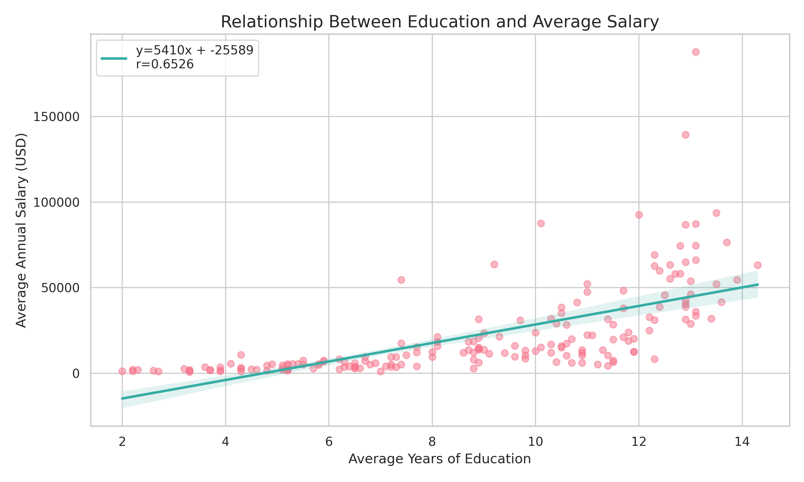
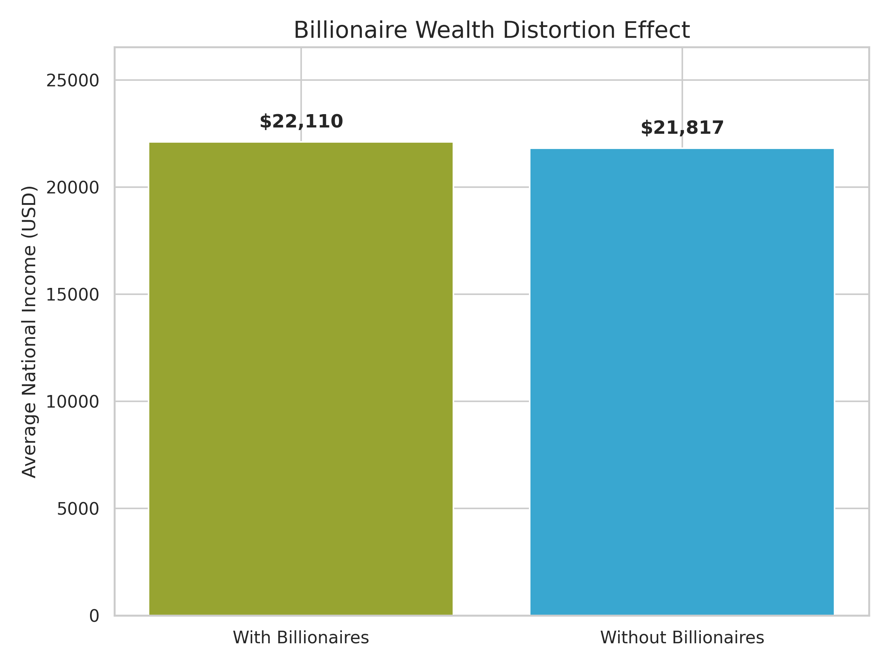
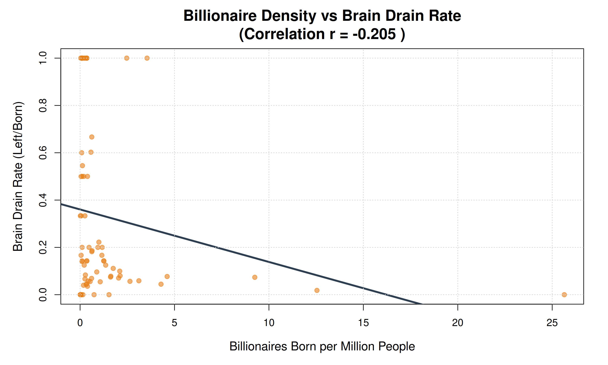
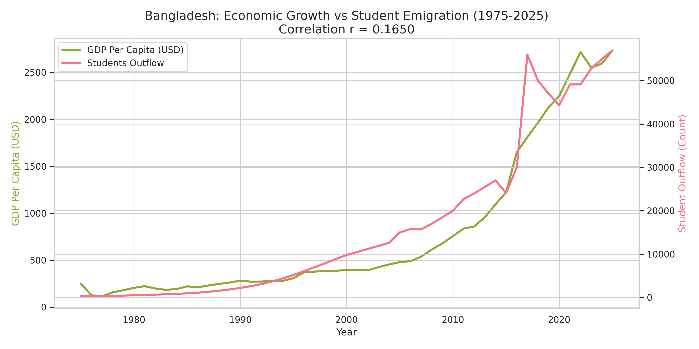

# Economic Analysis: Education, Wealth & Brain Drain Study

A comprehensive C-based analysis tool that examines the relationships between education, economic development, billionaire wealth distribution, and international brain drain across countries and over time.

---

## Project Overview

This project analyzes economic and demographic data to understand:
- How education impacts average national income
- The effect of billionaire wealth on income inequality
- The correlation between billionaire density and brain drain
- Bangladesh's unique case: economic growth vs. student emigration

The analysis is structured in 4 parts, each revealing different aspects of economic development and human migration patterns.

---

## Project Purpose and Contributors

This project was made by a group of 5 people (group 5) for academic purpose.

```
*** Group-5 Members ***

|              Name             | Roll No. |
|-------------------------------|----------|
| Maimuna Rahman                |    16    |
| Jannatul Mahabuba Adhora      |    05    |
| MD. Sharafatul Islam Shihab   |    49    |
| Zinna Tun Nahar Medha         |    27    |
| Zarin Subah                   |    38    |
```

```
*** Academic Details ***

Batch       :   31st
Course      :   CSE130 (Programming with C/C++)
Major       :   Applied Statistics And Data Science
Institute   :   Institute of Statistical Research and Training (ISRT)
University  :   University of Dhaka
```

## Project Structure

```
*** Economic Analysis Project ***

|--> 1. c_main.c              # Main program (4 analyses)
|--> 2. economics.h           # Economics function declarations
|--> 3. econ_func.c           # Economics calculations
|--> 4. statistics.h          # Statistics function declarations
|--> 5. stat_func.c           # Statistics calculations
|--> 6. world.csv             # Global country data
|--> 7. bangladesh.csv        # Bangladesh time-series data (1975-2025)
|--> 8. README.md             # This file
```

---

## How to Compile and Run

### Compilation
```bash
gcc -o analysis c_main.c econ_func.c stat_func.c -lm
```
(The `-lm` flag links the math library for `sqrt()`, `pow()`, etc.)

### Execution
```bash
./analysis
```

The program will:
1. Load world.csv and bangladesh.csv
2. Run all 4 analyses
3. Output comprehensive tables, statistics, and interpretations

---

## Data Files

### world.csv
Global dataset containing information on multiple countries:
- **avg_education**: Average years of formal education
- **avg_salary**: Average annual salary in USD
- **income_with_billionaire**: Total national income (including billionaires)
- **population_with_billionaire**: Total population
- **income_without_billionaire**: Total income excluding billionaires
- **population_without_billionaire**: Non-billionaire population
- **billionaire_left**: Number of billionaires who emigrated
- **billionaire_born**: Number of billionaires produced/born in country

### bangladesh.csv
Time-series data for Bangladesh (1975-2025):
- **year**: Calendar year
- **gdp_per_capita**: GDP per capita in USD
- **population**: Total population
- **students_out**: Number of students studying abroad

---

## Analysis 1: Per Capita Income Regression

**What it measures**: The relationship between education and average salary across countries.

**Method**: 
- Bivariate linear regression (X = education years, Y = annual salary)
- Pearson correlation coefficient (r)

**Key Statistics**:
- **Regression Slope (m)**: How much salary increases per additional year of education
- **Regression Intercept (c)**: Base salary with zero education years
- **Regression Equation**: `y = mx + c` predicts salary from education level
- **Correlation Coefficient (r)**: Measures strength of relationship
  - **r > 0.8**: Very strong positive relationship
  - **0.6 < r < 0.8**: Strong positive relationship
  - **0.4 < r < 0.6**: Moderate positive relationship
  - **r < 0.4**: Weak relationship

**What it tells us**: Whether more educated populations earn significantly higher incomes, indicating education's economic value.

[](Visualization/analysis1_education_vs_salary.png)

---

## ANALYSIS 1 Result: Education vs Income

- **Do educated countries earn more?**
  - **YES - MODERATE correlation (r = 0.6526)**
  - **Conclusion**: Education strongly predicts income potential

- **How much does each education year add to income?**
  - **$5,410 per additional year of education**
  - This is a significant economic return on education investment
  - Regression equation: `Salary = 5,410 x Education - 25,589`

---

## Analysis 2: Billionaire Effects Analysis

**What it measures**: How billionaire wealth distorts national income distribution.

**Method**: Univariate analysis comparing income with and without billionaires

**Key Statistics Calculated**:

**Part 1: Income WITH Billionaires**
- Average national income (per capita) including ultra-wealthy individuals
- Shows the "official" average that includes billionaire wealth

**Part 2: Income WITHOUT Billionaires**
- Average income of the regular population (bottom 99.99%)
- Shows what ordinary citizens actually earn

**Part 3: Wealth Gap Analysis**
- **Billionaire Income Effect**: Difference between "with" and "without" averages

- **Interpretation**: 
  - Large gaps indicate wealth concentration
  - Shows how billionaires skew income statistics upward
  - Reveals inequality: official statistics vs. reality

**What it tells us**: 
- How much billionaire wealth distorts national averages
- The true gap between the ultra-wealthy and ordinary citizens
- Whether a country's "average income" reflects the typical person's reality

[](Visualization/analysis2_billionaire_effect.png)

---
## ANALYSIS 2 Results: Billionaire Wealth Distortion

- **Is the "average income" realistic?**
  - **YES - VERY realistic**
  - Average with billionaires: $61,079
  - Average without billionaires: $60,026
  - Difference: Only **1.75%**
  - **Conclusion**: Unlike some developing nations, billionaires don't drastically inflate global averages

- **How much do billionaires skew statistics?**
  - **1.75% inflation effect**
  - Most countries in the dataset have relatively modest billionaire populations
  - Top billionaire concentrations (USA, China, Germany, India) exist but don't dominate weighted averages

---

## Analysis 3: Brain Drain vs Billionaire Density Correlation

**What it measures**: Whether countries that produce talented billionaires actually retain them.

**Method**: Bivariate correlation analysis

**Key Metrics**:

**Billionaire Density (X)**
- Formula: `Billionaires Born / Population (millions)`
- Measures how many billionaires a country produces per million people
- Indicator of national talent/productivity

**Brain Drain Rate (Y)**
- Formula: `Billionaires Left / Billionaires Born`
- Percentage of produced billionaires who emigrate
- Ranges from 0 (retain all) to 1+ (more left than born)

**Correlation Analysis**:
- **r > 0.6**: STRONG positive correlation
  - Paradox: Productive countries lose their talent!
  - Despite generating billionaires, the country cannot retain them
  - Classic "brain drain" problem

- **0.3 < r < 0.6**: MODERATE positive correlation
  - Some tendency for successful people to leave

- **-0.3 < r < 0.3**: WEAK/NO correlation
  - Billionaire density doesn't predict emigration
  - Other factors drive talent loss

- **r < -0.3**: NEGATIVE correlation
  - High-producing countries retain their talent well
  - Stable, thriving ecosystem

**What it tells us**: 
- Whether economic success creates "golden handcuffs" (people stay) or "brain drain" (talent flees)
- If a country produces talent but can't keep it, something is fundamentally wrong with opportunity/environment
- Which countries are losing their most productive citizens

[](Visualization/analysis3_brain_drain.png)

---
## ANALYSIS 3 Results: Brain Drain vs Billionaire Density

- **Do successful countries retain their talent?**
  - **WEAK CORRELATION (r = -0.2050)**
  - Billionaire density doesn't strongly predict emigration
  - Neither a strong brain drain nor strong retention pattern
  - **Conclusion**: Whether a country produces billionaires doesn't determine if they stay

- **Which countries are losing their best people?**
  - **100% brain drain countries (ALL billionaires leave):**
    1. Albania - 100% emigration
    2. Armenia - 100% emigration
    3. Azerbaijan - 100% emigration
    4. Barbados, Belarus, Belize, Bulgaria, Cuba, Georgia, Haiti
  - **These are smaller nations that produce 1-2 billionaires but lose them all**

  - **Countries retaining talent:**
    - USA: 704 billionaires born, 70 left (10% drain)
    - China: 607 born, 35 left (6% drain)
    - Germany: 134 born, 10 left (7% drain)
    - UK: 177 born, 10 left (6% drain)
  - **Conclusion**: Small nations lose ALL talent; large developed nations retain most

---

## Analysis 4: Bangladesh Case Study - Economic Growth vs Brain Drain

**What it measures**: The paradoxical relationship between Bangladesh's economic growth and student emigration (1975-2025).

**Method**: Time-series correlation analysis over 50 years

**Key Metrics**:

**Wealth Growth (X)**
- Formula: `(GDP_current - GDP_previous) / GDP_previous`
- Annual percentage change in GDP per capita
- Positive values = economic growth

**Drain Intensity (Y)**
- Formula: `Students Studying Abroad / Population`
- Measures the proportion of population pursuing education internationally
- Higher values = more people leaving to study

**Correlation Results**:

**If r > 0.5 (Positive Correlation)**:
- **Finding**: As Bangladesh grows economically, MORE students leave
- **Explanation**: Economic growth gives families MORE MONEY to send kids abroad
- **Paradox**: Development ENABLES brain drain rather than preventing it
- **Implication**: Despite increasing wealth, the country loses its most ambitious youth

**If r < -0.5 (Negative Correlation)**:
- **Finding**: Economic growth REDUCES student outflow
- **Explanation**: Better opportunities at home retain talent
- **Result**: Economic development successfully reduces emigration
- **Implication**: Home country becomes competitive with international opportunities

**If -0.5 < r < 0.5 (Weak Correlation)**:
- **Finding**: Economic growth and student migration are independent
- **Explanation**: Other factors (visa policies, cultural factors, family) drive emigration
- **Implication**: Money alone doesn't determine whether people stay or leave

**Summary Statistics**:
- **Average Annual Wealth Growth**: Trend in national development
- **Average Drain Intensity**: Long-term pattern of student emigration

**What it tells us**:
- Whether development solves or perpetuates brain drain
- Whether economic progress is self-sufficient or dependent on keeping talent
- The relationship between national prosperity and international mobility

[](Visualization/analysis4_bangladesh.png)

---
## ANALYSIS 4 Results: Bangladesh - Economic Growth vs Brain Drain (1975-2025)

- **Does Bangladesh's development reduce brain drain?**
  - **NO - VERY WEAK correlation (r = 0.1650)**
  - GDP per capita grew from $250 (1975) to $2,734 (2025) - **10.9x increase!**
  - Student outflow grew from 300 (1975) to 57,000 (2025) - **190x increase!**
  - Economic growth and emigration are essentially **independent**
  - **Conclusion**: Development alone DOES NOT reduce brain drain


  **Key insight**: Bangladesh shows a paradox:
  - Economy grows rapidly (5.69% annually)
  - Student emigration ALSO grows (doubled every 10 years since 1990s)
  - Development hasn't changed the emigration pattern
  - Implication: International opportunities and quality of life matter more than raw GDP growth

---

## Conclusion

This comprehensive analysis reveals several profound and often counter-intuitive relationships between wealth, education, and human migration:

### The Billionaire Paradox
We often perceive billionaires as the primary drivers or distorters of a nation's economic reality. However, our statistical analysis reveals a paradox: **while their individual wealth is astronomical, their impact on national per capita income statistics is surprisingly marginal.** Globally, the presence of billionaires only inflates average annual income by approximately **1.75%** ($22,110 vs $21,817 in our dataset). This suggests that national prosperity is built on a much broader base of economic activity than the ultra-wealthy alone, and the "average" citizen's economic reality is less affected by billionaires than public discourse often suggests.

### The Bangladesh Dilemma
Bangladesh presents a unique case of economic development decoupled from talent retention. Our 50-year study shows that as the country's GDP per capita increased over 10-fold, student emigration increased nearly 200-fold.
- **Independence of Growth**: With a very weak correlation (r = 0.1650), economic growth in Bangladesh does not naturally stem the flow of talent abroad.
- **The "Enabling" Effect**: Increased national wealth often provides families with the financial means to seek better educational and quality-of-life opportunities internationally, potentially accelerating the brain drain.
- **Final Verdict**: For Bangladesh, economic progress is a double-edged sword. To truly retain its "brain power," the focus must shift from raw GDP growth to creating a domestic environment that matches the systemic opportunities found abroad.

In conclusion, brain drain is not merely a symptom of poverty, but often a complex consequence of development in a globalized world. Policies must evolve beyond simple wealth creation to address the qualitative desires of a nation's most ambitious citizens.

---

