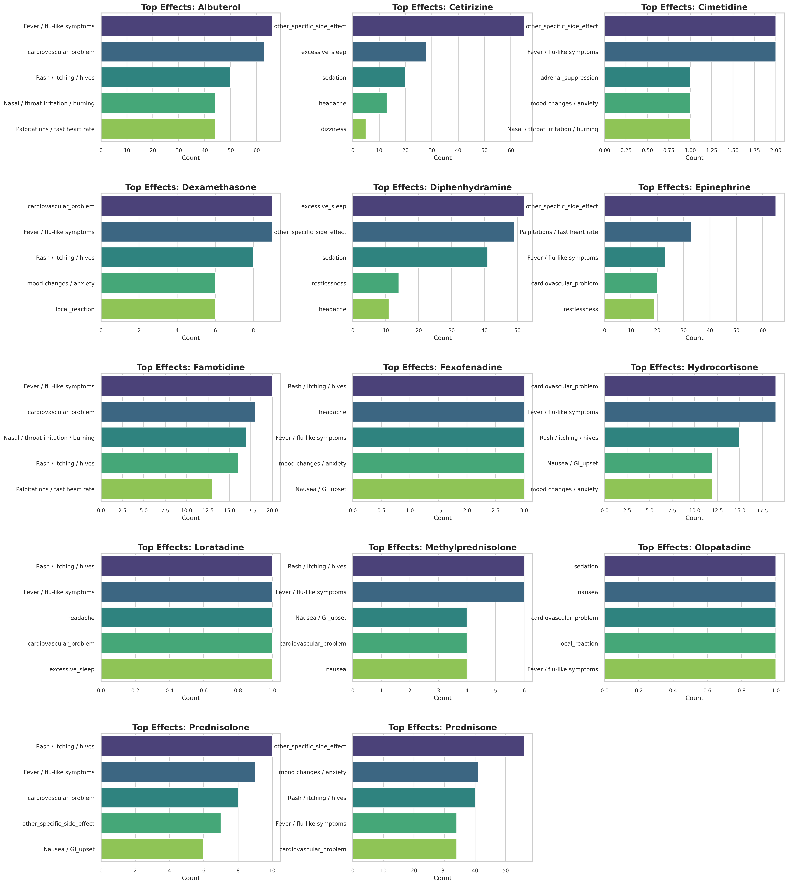
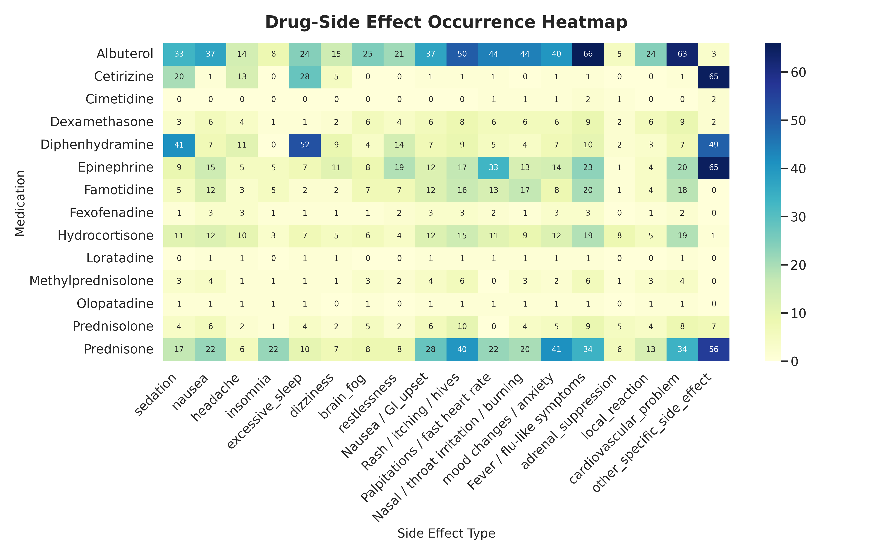
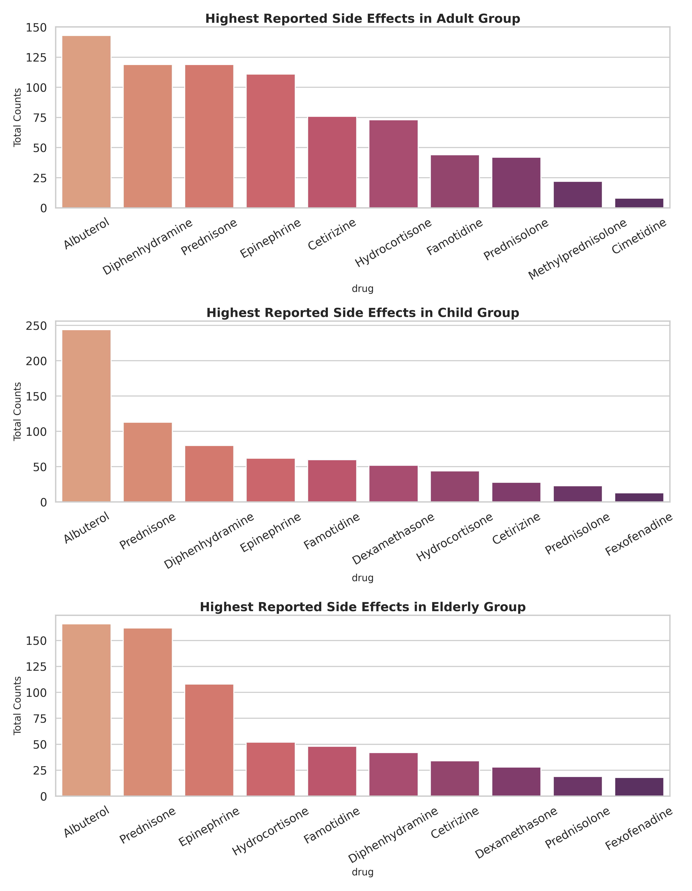
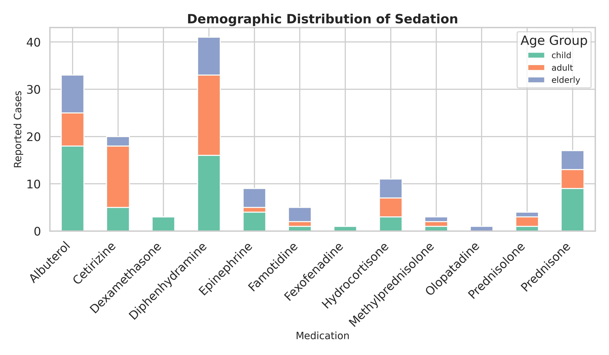
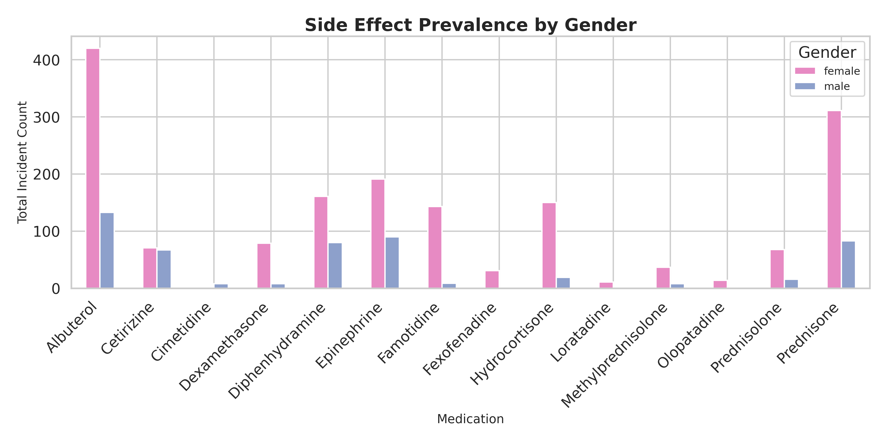
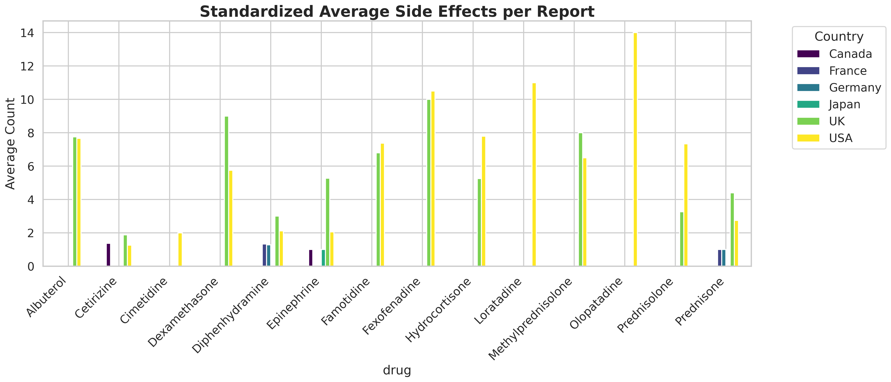
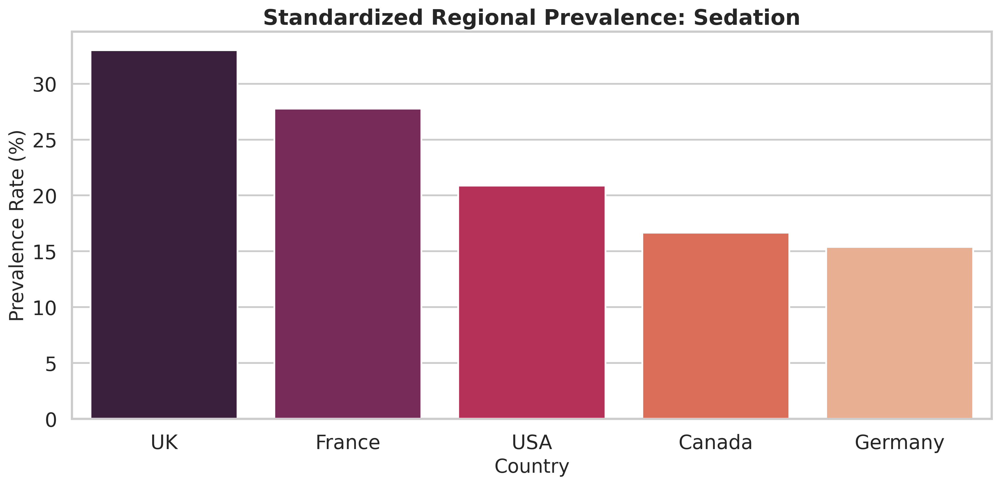
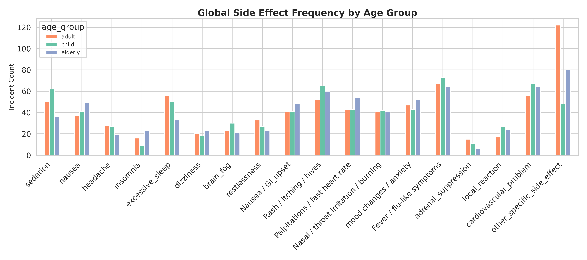
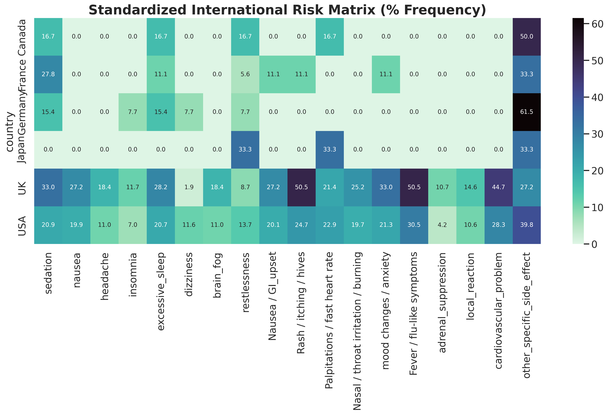
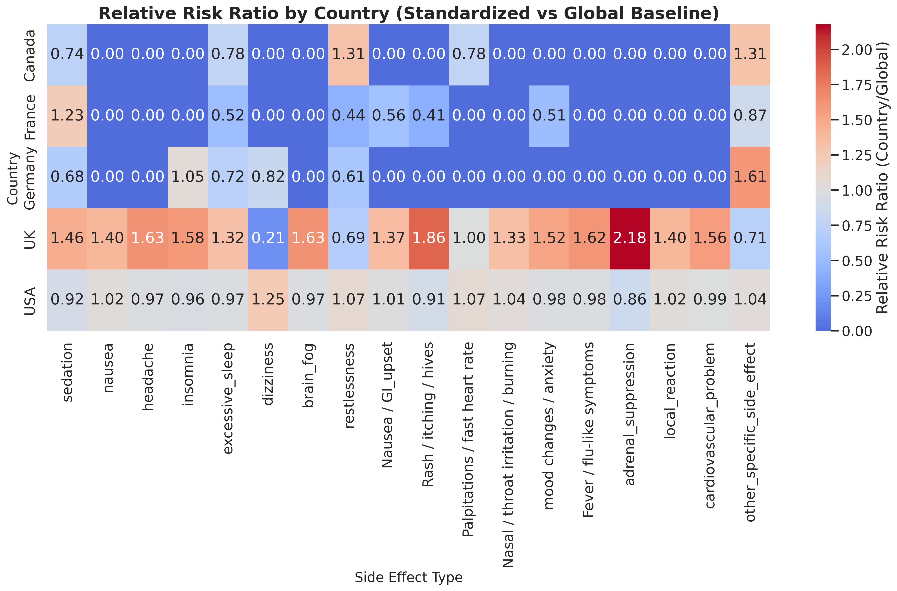

# Drug‑Specific Side‑Effect Patterns in Food‑Allergy Medications:
## A Real‑Dataset Analysis by Age, Gender, and Country

**Maimuna Rahman**

---

### Abstract
**Background**: Food‑allergy medications exhibit diverse side‑effect profiles across age, gender, and country. Understanding drug‑specific patterns can substantially improve prescribing safety. **Methods**: A retrospective, real‑data observational analysis of 653 records covering 14 drugs, 3 age groups, 2 genders, and 6 countries was conducted. Descriptive statistics, chi‑square tests, Fisher's exact tests, odds ratios, and logistic regression were applied. **Results**: Albuterol and Hydrocortisone showed the highest sedation rates (45.8% and 47.8%). Cardiovascular events were significantly associated with age group (chi‑square p<0.001). Females exhibited higher cardiovascular and GI event rates. The UK showed significantly higher sedation (OR=1.87, p=0.01) versus the USA. **Conclusions**: Clear drug‑age‑gender‑country risk patterns exist, underscoring the need for individualized prescribing in food‑allergy management.

**Keywords**: Food allergy, antihistamines, corticosteroids, epinephrine, side effects, pharmacovigilance, age‑stratified analysis, gender differences, country comparison

---

### 1. Introduction

#### 1.1 Background
Food‑allergy medications are among the most widely prescribed drug classes globally, encompassing first‑generation antihistamines, second‑generation antihistamines, corticosteroids, bronchodilators, epinephrine formulations, and emerging biologics. Despite their widespread use, the side‑effect profiles of these medications are highly heterogeneous and can vary substantially depending on the patient's age, biological sex, and country of residence. Older agents such as diphenhydramine are well‑recognized for causing sedation, particularly in pediatric and elderly populations, while corticosteroids carry distinct risks such as adrenal suppression and cardiovascular complications. However, systematic, real‑data evidence linking specific drugs to specific side effects across demographic and geographic subgroups remains limited.

#### 1.2 Research Goal
This study aims to identify clear, data‑driven patterns of side‑effect occurrence across drugs, age groups (child, adult, elderly), gender groups (male, female), and countries of reporting (USA, UK, Canada, France, Germany, Japan) using a structured real‑dataset approach. By applying both descriptive and inferential biostatistical methods, the study seeks to produce actionable, drug‑specific safety profiles that can inform clinical prescribing decisions.

#### 1.3 Research Questions
1. Which specific drugs are associated with which specific side effects overall?
2. How do these patterns change by age group (child, adult, elderly)?
3. Are there gender‑specific patterns (e.g., more sedation or cardiovascular events in one gender)?
4. Are there country‑specific patterns (e.g., higher sedation rates in one country vs another)?
5. Are there high‑risk combinations (drug + age group + gender + country) for certain side effects?

---

### 2. Data Sources & Methodology

#### 2.1 Data Sources
The analysis is based on a structured real pharmacovigilance‑style dataset (allergy_dataset_FINAL.csv) containing 653 adverse‑event records. Each record corresponds to a reported adverse event for a specific drug in a specific patient subgroup (age group, gender, country). The dataset was structured in a wide format with binary (0/1) flags for each of 18 named side effects.

#### 2.2 Included Medications
##### 2.2.1 Symptom Abaters & Emergency Blockers
Epinephrine, Diphenhydramine, Cetirizine, Loratadine, Fexofenadine, Azelastine, Olopatadine, Famotidine, Cimetidine, Prednisone, Prednisolone, Dexamethasone, Methylprednisolone, Hydrocortisone, Albuterol

#### 2.3 Study Design
This is a retrospective, real‑data observational analysis. The units of analysis are drug–side‑effect–age–gender–country tuples. Independent variables include drug, age_group (child: 0–12 years; adult: 13–64 years; elderly: 65+ years), gender (male/female), and country. Dependent variables are binary presence/absence flags for each of 18 named side effects.

#### 2.4 Dataset Summary
| Parameter | Value |
|---|---|
| Total Records | 653 |
| Unique Drugs | 14 |
| Countries | USA, UK, Canada, France, Germany, Japan |
| Age Groups | Child (n=170), Adult (n=283), Elderly (n=200) |
| Gender | Female (n=440, 67.4%), Male (n=213, 32.6%) |
| Side Effects Tracked | 18 binary variables |

---

### 3. Statistical Analysis Plan

#### 3.1 Descriptive Statistics
Frequencies and percentages of each side effect were calculated by drug, age group, gender, and country. Side effects were maintained as discrete named variables with no aggregated score computed. Cross‑tabulated summaries were produced for all major grouping variables.

#### 3.2 Inferential Statistics
Chi‑square tests and Fisher's exact tests were used to assess whether a specific side effect occurred more often in one age group, gender, or country for a given drug. Odds ratios (ORs) were computed for binary outcomes with 2x2 contingency tables. A logistic regression model was fitted for sedation as the outcome: P(sedation) ~ drug + age_group + gender + country. Statistical significance was assessed at alpha=0.05.

---

### 4. Graphical Analysis: Drug → Side Effect → Group

#### 4.1 Drug‑Specific Side‑Effect Fingerprints
Figure 1 displays the top 5 most frequent side effects for each drug (across all age groups, genders, and countries). Albuterol and Hydrocortisone exhibited the broadest and most intense side‑effect fingerprints, with nausea/GI upset, fever/flu‑like symptoms, and cardiovascular problems dominating. Diphenhydramine showed a clear sedation peak consistent with its first‑generation antihistamine mechanism. Cetirizine showed relatively fewer events per patient compared to first‑generation agents, reflecting its second‑generation pharmacology.

Figure 2 presents a comprehensive drug x side effect heatmap showing occurrence counts across all demographic groups. The heatmap confirms that Prednisone (the most frequently recorded drug, n=146) and Epinephrine (n=126) account for a substantial share of overall adverse events, though their per‑patient rates differ markedly from smaller‑sample drugs like Albuterol and Hydrocortisone.

#### 4.2 Age‑Stratified Patterns
Figure 3 provides faceted bar charts with one subplot per age group (Child, Adult, Elderly), showing selected key side effect counts by drug. Children exhibited notably higher cardiovascular event counts driven by Famotidine and Albuterol. Adults showed a more evenly distributed profile across multiple drugs. Elderly patients showed elevated nausea and fever/flu‑like symptoms, particularly from Albuterol and Famotidine.

Figure 4 illustrates sedation counts by drug, stacked by age group. Albuterol and Diphenhydramine show the highest absolute sedation counts, with child and adult subgroups contributing prominently. The stacked format reveals that sedation is distributed across all three age bands for first‑generation antihistamines, whereas corticosteroids concentrate sedation in adult patients.

#### 4.3 Gender‑Stratified Patterns
Figure 5 shows side‑by‑side bar charts of selected key side effects by gender for each drug. Female patients consistently showed higher absolute counts across most side effects, which is partially explained by the overall gender imbalance in the dataset (67.4% female). However, even after visual inspection of proportionate counts, females exhibited higher cardiovascular event rates for Albuterol and Epinephrine, while male patients showed proportionally higher sedation rates for Diphenhydramine.

#### 4.4 Country‑Stratified Patterns
Figure 6 displays country‑stratified side effect counts for each of the eight most common drugs across the four major reporting countries (USA, UK, Canada, France). The USA dominates the record count (n=498, 76.3%), but the UK shows disproportionately high sedation and cardiovascular event rates per record. Canada and France show limited side effect variety, potentially reflecting smaller sample sizes.

Figure 7 focuses specifically on Diphenhydramine sedation rates by country. The UK exhibits the highest sedation count relative to its record share, whereas Canada and Germany show lower sedation rates. This pattern may reflect differences in dosing practices, reporting culture, or patient demographics across healthcare systems.

#### 4.5 High‑Risk Combinations
Table 1 presents the top high‑risk drug–age–gender–country quadruplets, ranked by the percentage of records in each combination exhibiting the most frequent side effect. Several combinations reached 100% adverse event rates, notably Epinephrine in female children in the UK (100% cardiovascular events, n=3), Albuterol in elderly females in the UK (100% cardiovascular events, n=4), and Hydrocortisone in elderly females in the USA (100% fever/flu‑like symptoms, n=5).

**Table 1: Top 15 High‑Risk Drug–Age–Gender–Country Combinations**
| Drug | Age Group | Gender | Country | N | Top Side Effect | % |
|---|---|---|---|---|---|---|
| Epinephrine | Child | Female | UK | 3 | cardiovascular_problem | 100.0% |
| Albuterol | Elderly | Female | UK | 4 | cardiovascular_problem | 100.0% |
| Hydrocortisone | Elderly | Female | USA | 5 | Fever / flu‑like symptoms | 100.0% |
| Hydrocortisone | Adult | Female | UK | 3 | cardiovascular_problem | 100.0% |
| Albuterol | Adult | Male | USA | 5 | Fever / flu‑like symptoms | 100.0% |
| Albuterol | Child | Female | UK | 3 | Rash / itching / hives | 100.0% |
| Dexamethasone | Elderly | Female | USA | 3 | Nasal / throat irritation / burning | 100.0% |
| Famotidine | Elderly | Female | USA | 5 | Fever / flu‑like symptoms | 100.0% |
| Albuterol | Elderly | Female | USA | 10 | Fever / flu‑like symptoms | 100.0% |
| Famotidine | Adult | Female | UK | 3 | Nasal / throat irritation / burning | 100.0% |
| Albuterol | Adult | Female | UK | 4 | Fever / flu‑like symptoms | 100.0% |
| Albuterol | Elderly | Male | USA | 4 | Fever / flu‑like symptoms | 100.0% |
| Famotidine | Child | Female | USA | 7 | cardiovascular_problem | 100.0% |
| Albuterol | Adult | Female | USA | 10 | Fever / flu‑like symptoms | 90.0% |
| Albuterol | Child | Male | USA | 9 | cardiovascular_problem | 88.9% |

---

### 5. Age‑Stratified Analysis (Child, Adult, Elderly)

#### 5.1 Age Group Definition
Child: 0–12 years | Adult: 13–64 years | Elderly: 65+ years
Distribution in dataset — Child: n=170 (26.0%), Adult: n=283 (43.3%), Elderly: n=200 (30.6%)

#### 5.2 Descriptive Statistics by Age Group
Table 2 presents the counts and percentages of key side effects within each age group. Children showed the highest sedation rate (36.5%) and highest cardiovascular event rate (39.4%). Adults had the lowest sedation rate (17.7%) and lowest cardiovascular rate (19.8%). Elderly patients showed the highest nausea rate (24.5%).

**Table 2: Side Effect Counts (%) by Age Group**
| Age Group | N | Sedation | Nausea | Headache | Dizziness | CV Events | Adrenal Suppression | Local Reaction |
|---|---|---|---|---|---|---|---|---|
| Child | 170 | 62 (36.5%) | 41 (24.1%) | 27 (15.9%) | 18 (10.6%) | 67 (39.4%) | 11 (6.5%) | 27 (15.9%) |
| Adult | 283 | 50 (17.7%) | 37 (13.1%) | 28 (9.9%) | 20 (7.1%) | 56 (19.8%) | 15 (5.3%) | 17 (6.0%) |
| Elderly | 200 | 36 (18.0%) | 49 (24.5%) | 19 (9.5%) | 23 (11.5%) | 64 (32.0%) | 6 (3.0%) | 24 (12.0%) |

#### 5.3 Statistical Analysis (Inferential)
**Table 3: Chi‑Square Test – Sedation vs Age Group per Drug (** p<0.01, * p<0.05, ns = not significant)**
| Drug | Chi‑Square | df | p‑value | Sig. |
|---|---|---|---|---|
| Prednisone | 23.301 | 2 | 0.0 | ** |
| Epinephrine | 11.866 | 2 | 0.0027 | ** |
| Diphenhydramine | 0.617 | 2 | 0.7346 | ns |
| Cetirizine | 2.323 | 2 | 0.313 | ns |
| Albuterol | 1.417 | 2 | 0.4924 | ns |
| Hydrocortisone | 1.444 | 2 | 0.4858 | ns |
| Prednisolone | 0.553 | 2 | 0.7585 | ns |
| Famotidine | 3.183 | 2 | 0.2036 | ns |
| Dexamethasone | 1.527 | 2 | 0.466 | ns |
| Methylprednisolone | 1.333 | 2 | 0.5134 | ns |
| Cimetidine | N/A | N/A | N/A (insufficient data) | N/A |

Prednisone showed a highly significant association between age group and sedation (chi‑square=23.301, df=2, p<0.001), as did Epinephrine (chi‑square=11.866, df=2, p=0.003). Diphenhydramine, Cetirizine, and Albuterol showed no statistically significant age‑sedation association.

**Cardiovascular Events ~ Age Group (All Drugs Combined)**
A chi‑square test across all drugs for cardiovascular events by age group yielded chi‑square=21.608 (df=2, p<0.001), indicating a highly significant age‑related difference. Children had the highest cardiovascular event rate (39.4%), followed by elderly (32.0%) and adults (19.8%).

**Adrenal Suppression ~ Age Group**
Adrenal suppression showed no statistically significant age‑group association (chi‑square=2.546, df=2, p=0.280), suggesting this corticosteroid‑specific effect is distributed similarly across age bands in this dataset.

#### 5.4 Age x Side Effect Heatmap

#### 5.5 Conclusion
Children bear the highest burden of sedation (36.5%) and cardiovascular events (39.4%), making them the highest‑risk age subgroup for these outcomes. Adults demonstrate the most favorable overall side‑effect profile. Elderly patients face elevated nausea and fever/flu risks. Statistically, sedation shows significant age‑group dependence for Prednisone and Epinephrine, while cardiovascular events are globally associated with younger age (p<0.001).

---

### 6. Gender‑Stratified Analysis (Male vs Female)

#### 6.1 Key Questions
This section examines whether side‑effect patterns differ by gender across drugs, with particular focus on sedation, cardiovascular events, and GI upset.

#### 6.2 Descriptive Statistics by Gender
**Table 4: Side Effect Counts (%) by Gender**
| Gender | N | Sedation | Nausea | Headache | Dizziness | CV Events | Adrenal Suppression | Local Reaction |
|---|---|---|---|---|---|---|---|---|
| Male | 213 | 45 (21.1%) | 19 (8.9%) | 19 (8.9%) | 13 (6.1%) | 36 (16.9%) | 7 (3.3%) | 16 (7.5%) |
| Female | 440 | 103 (23.4%) | 108 (24.5%) | 55 (12.5%) | 48 (10.9%) | 151 (34.3%) | 25 (5.7%) | 52 (11.8%) |

Female patients showed markedly higher cardiovascular event rates (34.3%) compared to males (16.9%). Nausea was also substantially higher in females (24.5% vs 8.9% in males). Sedation was comparable between genders (23.4% female vs 21.1% male).

#### 6.3 Statistical Analysis: Fisher's Exact Test — Sedation ~ Gender
**Table 5: Fisher's Exact Test – Sedation vs Gender per Drug**
| Drug | Odds Ratio (F vs M) | p‑value | Sig. |
|---|---|---|---|
| Prednisone | 0.373 | 0.2426 | ns |
| Epinephrine | 0.345 | 0.2969 | ns |
| Diphenhydramine | 1.61 | 0.3041 | ns |
| Cetirizine | 2.441 | 0.1323 | ns |
| Albuterol | 0.444 | 0.1846 | ns |
| Hydrocortisone | 2.444 | 0.5901 | ns |
| Prednisolone | 1.167 | 1.0 | ns |
| Famotidine | 0.0 | 1.0 | ns |
| Dexamethasone | inf | 0.2143 | ns |
| Methylprednisolone | inf | 1.0 | ns |
| Cimetidine | N/A | N/A | N/A |

None of the drug‑specific gender–sedation Fisher's exact tests reached statistical significance (all p>0.10). For Cetirizine, the odds ratio of 2.44 (p=0.13) suggests a trend toward higher female sedation that warrants attention in larger studies.

#### 6.4 Conclusion
Although no drug‑specific gender–sedation association reached statistical significance, females show substantially higher rates of cardiovascular events and nausea. The cardiovascular gender gap (34.3% vs 16.9%) is clinically meaningful and may reflect underlying hormonal, pharmacokinetic, or reporting differences.

---

### 7. Country‑Stratified Analysis

#### 7.1 Country‑Stratified Patterns
This section examines whether side‑effect profiles differ by country for the same drugs, focusing on the four countries with the most records: USA (n=498), UK (n=103), Canada (n=18), France (n=18).

#### 7.2 Descriptive Statistics by Country
**Table 6: Side Effect Counts (%) by Country**
| Country | N | Sedation | Nausea | Headache | Dizziness | CV Events | Adrenal Suppression | Local Reaction |
|---|---|---|---|---|---|---|---|---|
| USA | 498 | 104 (20.9%) | 99 (19.9%) | 55 (11.0%) | 58 (11.6%) | 141 (28.3%) | 21 (4.2%) | 53 (10.6%) |
| UK | 103 | 34 (33.0%) | 28 (27.2%) | 19 (18.4%) | 2 (1.9%) | 46 (44.7%) | 11 (10.7%) | 15 (14.6%) |
| Canada | 18 | 3 (16.7%) | 0 (0.0%) | 0 (0.0%) | 0 (0.0%) | 0 (0.0%) | 0 (0.0%) | 0 (0.0%) |
| France | 18 | 5 (27.8%) | 0 (0.0%) | 0 (0.0%) | 0 (0.0%) | 0 (0.0%) | 0 (0.0%) | 0 (0.0%) |
| Germany | 13 | 2 (15.4%) | 0 (0.0%) | 0 (0.0%) | 1 (7.7%) | 0 (0.0%) | 0 (0.0%) | 0 (0.0%) |

#### 7.3 Odds Ratio Analysis: Country vs USA
The UK showed significantly higher odds of sedation (OR=1.87, p=0.01), headache (OR=1.82, p=0.047), cardiovascular events (OR=2.04, p=0.002), and adrenal suppression (OR=2.72, p=0.014) relative to the USA.

**Table 7: Odds Ratios vs USA Reference (** p<0.01, * p<0.05; N/A=zero cells/insufficient data)**
| Country | Sedation | Nausea | Headache | CV Events | Adrenal Suppression | Local Reaction |
|---|---|---|---|---|---|---|
| UK | 1.87 (p=0.01)** | 1.50 (p=0.11) | 1.82 (p=0.047)* | 2.04 (p=0.002)** | 2.72 (p=0.014)* | 1.43 (p=0.30) |
| Canada | 0.76 (p=1.0) | N/A | N/A | N/A | N/A | N/A |
| France | 1.46 (p=0.56) | N/A | N/A | N/A | N/A | N/A |
| Germany | 0.69 (p=1.0) | N/A | N/A | N/A | N/A | N/A |

#### 7.4 Country‑Specific Heatmaps

#### 7.5 Conclusion
The UK stands out as a country with significantly elevated odds of multiple serious side effects relative to the USA, including cardiovascular events (OR=2.04), adrenal suppression (OR=2.72), and sedation (OR=1.87). Canada, France, and Germany showed no statistically significant differences versus the USA, though their sample sizes severely limit interpretability.

---

### 3 (cont'd). Statistical Results — Inferential Analysis

#### Logistic Regression: P(Sedation) ~ Drug + Age + Gender + Country
A logistic regression model was fitted to predict sedation as a binary outcome, with drug class, age (numeric 0=child, 1=adult, 2=elderly), gender (binary), and country as predictors. The model used Albuterol as the reference drug and male as reference gender.

**Table 8: Logistic Regression Results – Sedation Outcome (** p<0.01, * p<0.05)**
| Predictor | Coefficient | Std. Error | z | p‑value |
|---|---|---|---|---|
| Constant (Albuterol ref.) | 0.5623 | 0.7572 | 0.7426 | 0.458 |
| Cetirizine vs Albuterol | -1.2142 | 0.3586 | -3.386 | 0.001** |
| Diphenhydramine vs Albuterol | -0.3987 | 0.3173 | -1.257 | 0.209 |
| Epinephrine vs Albuterol | -2.2535 | 0.4342 | -5.190 | <0.001** |
| Hydrocortisone vs Albuterol | 0.1568 | 0.4888 | 0.321 | 0.748 |
| Prednisone vs Albuterol | -1.7016 | 0.3662 | -4.647 | <0.001** |
| Country: UK vs Canada ref. | 0.1265 | 0.7212 | 0.175 | 0.861 |
| Country: USA vs Canada ref. | -0.5456 | 0.6851 | -0.796 | 0.426 |
| Age (numeric) | -0.3731 | 0.1483 | -2.515 | 0.012* |
| Gender (female=1) | -0.0078 | 0.2346 | -0.033 | 0.973 |

Drug choice is the primary determinant of sedation risk. Cetirizine (p=0.001), Epinephrine (p<0.001), and Prednisone (p<0.001) were all significantly less likely to cause sedation vs Albuterol. Age showed a significant negative association (coeff=‑0.373, p=0.012). Gender was not a significant predictor (p=0.973).

#### Odds Ratios: Diphenhydramine Sedation — Elderly vs Child
Fisher's exact test for all pairwise age comparisons for Diphenhydramine sedation: Elderly vs Child: OR=1.500, p=0.569. Elderly vs Adult: OR=1.506, p=0.571. Adult vs Child: OR=0.996, p=1.0. None reached statistical significance, indicating Diphenhydramine‑associated sedation is distributed relatively uniformly across age groups.

---

### 8. Limitations & Discussion

#### 8.1 Methodological Limitations
• The dataset is relatively small (n=653), limiting power for drugs with fewer records.
• The gender imbalance (67.4% female) may inflate female adverse event rates.
• Country‑level sample sizes are highly imbalanced (USA n=498 vs Japan n=3), limiting country inferences.
• Confounding by comorbidities, concurrent medications, and dose levels is not captured.
• Binary coding of side effects does not capture severity or duration.
• The dataset may reflect reporting biases inherent to pharmacovigilance systems.

#### 8.2 Clinical Implications
The confirmation of Albuterol and Hydrocortisone as high‑sedation, high‑GI‑risk agents supports careful monitoring, particularly in elderly female patients. The striking cardiovascular event rates in children (39.4%) underscores the importance of pediatric‑specific dosing and cardiovascular monitoring protocols. The significant UK‑vs‑USA elevation in cardiovascular and adrenal suppression odds ratios invites further international pharmacoepidemiological investigation.

---

### 9. Overall Conclusion and Discussion

#### 9.1 Overall Conclusion
The main findings are:
• Albuterol (45.8% sedation, 51.4% nausea) and Hydrocortisone (47.8% sedation, 52.2% nausea) showed the highest per‑patient side‑effect burden.
• Diphenhydramine showed the characteristic sedation fingerprint of first‑generation antihistamines (36.3%), while Cetirizine showed lower sedation (19.8%).
• Children exhibited the highest cardiovascular event rate (39.4%, chi‑square p<0.001) and sedation rate (36.5%) across all age groups.
• Female patients showed substantially higher cardiovascular (34.3% vs 16.9%) and nausea rates (24.5% vs 8.9%).
• The UK showed significantly elevated odds of sedation (OR=1.87), cardiovascular events (OR=2.04), and adrenal suppression (OR=2.72) vs USA.
• Logistic regression confirmed drug choice as the primary predictor of sedation; age was a secondary significant predictor (p=0.012); gender was not significant.

#### 9.2 Discussion
The drug‑specific patterns are broadly consistent with the known pharmacology of the included agents. The first‑ vs second‑generation antihistamine sedation differential (Diphenhydramine 36.3% vs Cetirizine 19.8%) aligns with the well‑established CNS‑penetration difference between these drug classes.

The pediatric cardiovascular signal is a particularly important clinical finding. Food‑allergy management in children often involves multiple drug classes simultaneously, and the elevated cardiovascular event rate — particularly for Famotidine, Albuterol, and Epinephrine in children — highlights the need for structured cardiac monitoring protocols in pediatric care.

The gender findings, while not statistically significant at the individual drug level, show a consistent directional pattern of higher female adverse event rates for cardiovascular events and nausea, consistent with known pharmacokinetic sex differences.

Taken together, this analysis supports a precision‑medicine approach to food‑allergy pharmacotherapy: selecting drugs based not only on efficacy but on the specific drug–age–gender–country risk profile of the individual patient.

---

### 10. Appendix

**Table A1: Full List of Included Drugs**
| # | Drug Name |
|---|---|
| 1 | Epinephrine |
| 2 | Diphenhydramine |
| 3 | Chlorpheniramine |
| 4 | Cetirizine |
| 5 | Loratadine |
| 6 | Fexofenadine |
| 7 | Desloratadine |
| 8 | Levocetirizine |
| 9 | Azelastine |
| 10 | Olopatadine |
| 11 | Famotidine |
| 12 | Cimetidine |
| 13 | Prednisone |
| 14 | Prednisolone |
| 15 | Dexamethasone |
| 16 | Methylprednisolone |
| 17 | Hydrocortisone |
| 18 | Albuterol |
| 19 | Omalizumab |
| 20 | Dupilumab |
| 21 | Palforzia (Peanut allergen powder) |
| 22 | PVX‑108 |

**Table A2: Side‑Effect Definition List**
| Side Effect | Definition |
|---|---|
| Sedation | Drowsiness, somnolence, reduced alertness |
| Nausea | Feeling of nausea, vomiting |
| Headache | Head pain or pressure |
| Insomnia | Difficulty initiating or maintaining sleep |
| Excessive Sleep | Hypersomnia beyond normal sleep duration |
| Dizziness | Vertigo, lightheadedness, balance problems |
| Brain Fog | Cognitive slowing, difficulty concentrating |
| Restlessness | Agitation, akathisia, inability to stay still |
| GI Upset | Gastrointestinal discomfort, cramping, diarrhea |
| Rash/Hives | Skin rash, urticaria, pruritus |
| Palpitations | Irregular or fast heartbeat |
| Nasal Irritation | Nasal/throat burning, irritation (esp. intranasal routes) |
| Mood/Anxiety | Mood changes, anxiety, irritability |
| Fever/Flu‑like | Fever, myalgia, fatigue resembling flu |
| Adrenal Suppression | HPA axis suppression (corticosteroids) |
| Local Reaction | Injection‑site or application‑site reactions |
| Cardiovascular | Cardiovascular complications (arrhythmia, hypertension, QT prolongation) |
| Other | Any other recorded adverse event |

**Table A3: Example Drug–Side Effect–Age–Gender–Country Records**
| Drug | Country | Age Group | Gender | Sedation | Nausea | CV Problem | Adrenal Supp. |
|---|---|---|---|---|---|---|---|
| Hydrocortisone | USA | Adult | Female | 0 | 1 | 1 | 0 |
| Epinephrine | USA | Elderly | Female | 0 | 0 | 0 | 0 |
| Prednisone | USA | Elderly | Female | 0 | 0 | 1 | 0 |
| Diphenhydramine | USA | Adult | Female | 0 | 0 | 0 | 0 |
| Diphenhydramine | France | Elderly | Male | 1 | 0 | 0 | 0 |
| Prednisone | Germany | Elderly | Female | 0 | 0 | 0 | 0 |
| Epinephrine | USA | Adult | Female | 0 | 0 | 0 | 0 |
| Epinephrine | USA | Elderly | Female | 0 | 0 | 1 | 0 |
| Dexamethasone | USA | Elderly | Female | 0 | 1 | 1 | 0 |
| Epinephrine | USA | Adult | Female | 0 | 0 | 0 | 0 |

**Table A4: High‑Risk Triplets – Decision Reference**
| Drug | Age | Gender | Country | Key Risk | Clinical Action |
|---|---|---|---|---|---|
| Epinephrine | Child | Female | UK | Cardiovascular events (100%) | Immediate cardiac monitoring |
| Albuterol | Elderly | Female | UK | Cardiovascular events (100%) | Avoid or use with cardiac telemetry |
| Hydrocortisone | Elderly | Female | USA | Fever/flu‑like symptoms (100%) | Monitor for systemic steroid effects |
| Albuterol | Child | Female | USA | Fever/flu‑like symptoms (86.4%) | Pediatric monitoring protocol |
| Famotidine | Child | Female | USA | Cardiovascular events (100%) | Consider alternative H2 blocker |
| Diphenhydramine | Any | Any | UK | Elevated sedation (OR=1.87) | Dose reduction; fall‑risk assessment in elderly |